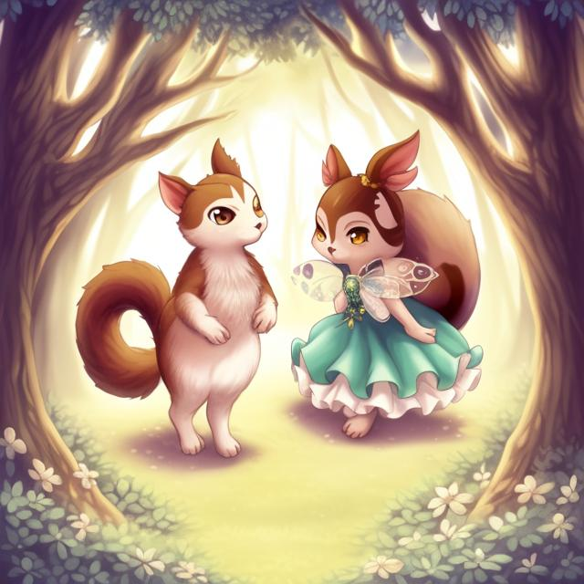

# A Tale of Two Squirrels

Once upon a time, in a forest far away, there lived two squirrels. One was named Nutmeg and the other was named Cinnamon. They were the best of friends and always went on adventures together.

One day, while they were out exploring, they stumbled upon a clearing they had never seen before. In the center of the clearing was a strange tree they had never seen before. It was taller than any tree they had ever seen, and its bark was black and twisted.

Curiosity getting the better of them, Nutmeg and Cinnamon climbed the tree. When they reached the top, they found a nest, made of twigs and leaves, and inside the nest was a single, shiny, black acorn.

Nutmeg reached for the acorn, but before he could grab it, the tree came to life. Its branches wrapped around Nutmeg and Cinnamon, trapping them.

The tree spoke, its voice deep and menacing. "You dare to steal from me? I am the Dark Tree, the bringer of nightmares. You will never leave this forest, you will be trapped here forever."

Nutmeg and Cinnamon were terrified. They didn't know what to do. The Dark Tree laughed, a deep, cruel laugh that echoed through the forest.

Days turned into weeks, and weeks turned into months. Nutmeg and Cinnamon were still trapped in the tree, unable to escape. The Dark Tree would taunt them, telling them stories of the terrible things that happened to those who dared to cross it.

One day, Nutmeg had an idea. He whispered it to Cinnamon, and they began to work on a plan. They knew they had to get the acorn and destroy it, for it was the source of the Dark Tree's power.

Nutmeg and Cinnamon knew they had to destroy the acorn, but they also knew it wouldn't be easy. They spent weeks studying the Dark Tree, trying to figure out its weaknesses.

Finally, they came up with a plan. They would distract the Dark Tree by throwing nuts at it from a distance. Then, Nutmeg would climb up the tree and grab the acorn while Cinnamon kept watch below.

Once Nutmeg had the acorn, they would use all their strength to break it. They knew it wouldn't be easy, but they were determined to succeed.

When the day of the plan arrived, Nutmeg and Cinnamon were nervous but determined. They began throwing nuts at the Dark Tree, trying to get its attention. The tree roared in anger, its branches lashing out at them.

Meanwhile, Nutmeg climbed up the tree as fast as he could. He could feel the tree trying to wrap its branches around him, but he was too quick. He reached the top and grabbed the acorn, holding it tightly.

Cinnamon kept watch below, ready to help if anything went wrong. He saw Nutmeg grab the acorn and shouted up to him, "Now, Nutmeg! Break it!"

Nutmeg used all his strength to break the acorn, and as he did, the Dark Tree let out a terrible scream. The tree began to wither and die, and Nutmeg and Cinnamon were free.

They ran as fast as they could out of the forest, never looking back. From that day on, they knew they had accomplished something great. They had defeated the Dark Tree and saved themselves and the forest from its evil power.

Years passed and Nutmeg and Cinnamon grew old. They had many young squirrels who loved to hear their tales of adventure. The two squirrels were happy to tell them, but they always made sure to warn their children and grandchildren about the dangers of the forest.

One day, as Nutmeg and Cinnamon were sitting outside their den enjoying the sunshine, a young squirrel named Hazel approached them. "Excuse me," he said. "I couldn't help but overhear your stories. I want to go on an adventure just like you did when you were young."

Nutmeg and Cinnamon looked at each other, worried. They remembered their own adventures and the dangers they had faced. They didn't want this young squirrel to suffer the same fate.

But the young squirrel was determined. "Please," he said. "I promise to be careful. I just want to see what's out there."

Nutmeg and Cinnamon thought about it for a moment. They remembered how much they had learned from their own adventures, and they didn't want to deny that experience to the young squirrel.

"Very well," Nutmeg said. "But promise us that you will be careful. The forest is full of dangers, and you must always be on the lookout."

The young squirrel nodded eagerly, and Nutmeg and Cinnamon began to tell him tales of their adventures. They warned him about the Dark Tree and the other dangers that lurked in the forest.

The young squirrel listened carefully, and he promised to be careful. And so, he set out on his own adventure, eager to see what the forest had in store for him.

Nutmeg and Cinnamon watched him go, hoping that he would return safely. They knew that the forest was full of wonders, but also full of danger. They hoped that the young squirrel would learn from his own experiences, just as they had learned from theirs.

As the young squirrel wandered through the forest, he was amazed by the beauty of nature that surrounded him. The gentle rustling of the leaves in the trees, the chirping of birds, and the soft sound of the waterfall in the distance all contributed to the serene atmosphere. He stopped to admire the waterfall, which sparkled and shimmered in the sunlight, as the droplets of water cascaded down the rocks.

As he continued on his journey, he noticed a field of flowers that stretched as far as the eye could see, with a rainbow of colors represented in each petal. The sweet scent of the flowers filled the air and he paused to take in the beauty of the sight before him. Suddenly, he heard a rustling in the grass and saw a family of rabbits emerging from their burrow. They welcomed him with open arms and invited him to share their meal of fresh greens, which he eagerly accepted. As they ate, they shared stories of their life in the forest and the squirrel was fascinated by their tales of adventure and bravery.

As Hazel journeyed further, he not only witnessed the wonders that Nutmeg and Cinnamon had described to him, but he also encountered several dangers they had warned him about. He glimpsed the Dark Tree, with its branches contorted like the fingers of a witch, threatening to ensnare him.

But, the Dark Tree has been defeated by Nutmeg and Cinnamon, why is it revived again?

Hazel stumbled upon a pack of wolves, their eyes ablaze in the night, ready to pounce should he make a wrong move. And he came upon a tumultuous river, with such force that it could easily sweep him away, forcing him to struggle to stay afloat. However, despite these obstacles, Hazel pushed on, driven by his determination to see his mission through to the end.

Hazel knew that he couldn't let the Dark Tree and its minions stop him. He had heard stories of the tree's evil power, and he was determined to put an end to it. As he approached the Dark Tree, he could feel the malevolence radiating from it. The tree's branches stretched out towards him, and Hazel knew that he had to act fast. He took a deep breath and began to run, dodging the branches as he went. When he reached the trunk, he pulled out his sword and struck the tree with all his might.

The sword bounced off the tree's bark, leaving only a scratch. The Dark Tree laughed, its voice deep and cruel. "You dare to challenge me? I am the bringer of nightmares, the ruler of this forest! You are nothing but a small and weak creature."

Hazel knew he had made a mistake. He should have listened to Nutmeg and Cinnamon's warnings. The Dark Tree was too powerful for him to defeat. He tried to run, but the tree's branches wrapped around him, trapping him.

Days turned into weeks, and weeks turned into months. Hazel was still trapped in the tree, unable to escape. The Dark Tree would taunt him, telling him stories of the terrible things that happened to those who dared to cross it.

Hazel knew he had made a terrible mistake. He should have listened to Nutmeg and Cinnamon's warnings. The Dark Tree was too powerful for him to defeat. He tried to run, but the tree's branches wrapped around him, trapping him.

And to his surprise he also found Nutmeg and Cinnamon on the tree. He asked them: “Why are you two here?”

"We were foolish, just like you," Nutmeg and Cinnamon said. "We thought we could defeat the Dark Tree, but we were wrong. Now we are trapped here, just like you. Did you see that acorn?"

At this moment, an acorn took the shape of Hazel, walked slowly towards the village, disappeared before the horizon, and looked back at them with an evil smile.

“Goodbye, heroes.”

