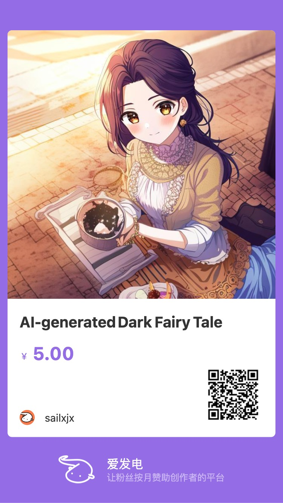

# AI-generated (dark) fairy tales

There is no doubt that AIGC has brought a qualitative leap to productivity. This project is a collection of graphic novels generated entirely by AI.

The purpose is to pursue the readability and fun of the story, not to show the technical power of AI (this no longer needs proof).

AI still has certain limitations in terms of creativity. For example, our common fairy tales usually have a happy ending, so when using AI to write,
they often end with a happy ending, such as the hero embracing the beauty. In order to increase the fun and challenge of the story, I chose to use dark fairy tales as the theme,
which may contain blood and horror plots, but there will be no content beyond the limits of AI tools (such as pornography, crime).

In the process, I will guide the AI to generate the content I want, and the AI will also inspire my creative thinking,
which is an experience that cannot be obtained by writing alone (or using a search engine).

Each story takes 1 hours to write and find suitable images, because the AI needs to be guided in the direction of the dark fairy tale, requiring some human guidance.
After I become more proficient, I expect to generate these stories faster.

## Tools

- [Notion AI](https://www.notion.so/product/ai)
- [MakaMaka](https://makamaka.io/)

## Novel list

- [A Tale of Two Squirrels](A-Tale-of-Two-Squirrels/readme.md)
- [Dark Riding Hood](Dark-Riding-Hood/readme.md)
- [Rise of Darth Vader](Rise-of-Darth-Vader/readme.md)
- [The Adventure of Baby Shark](The-Adventure-of-Baby-Shark/readme.md)
- [Tortoise, Rabbit and Mario](Tortoise-Rabbit-and-Mario/readme.md)
- To be continue

## Sponsor me

