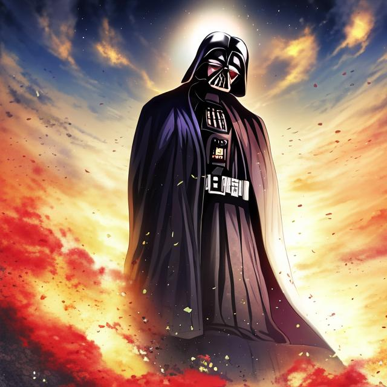
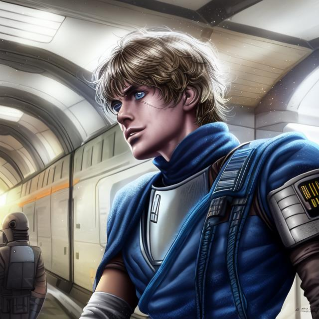
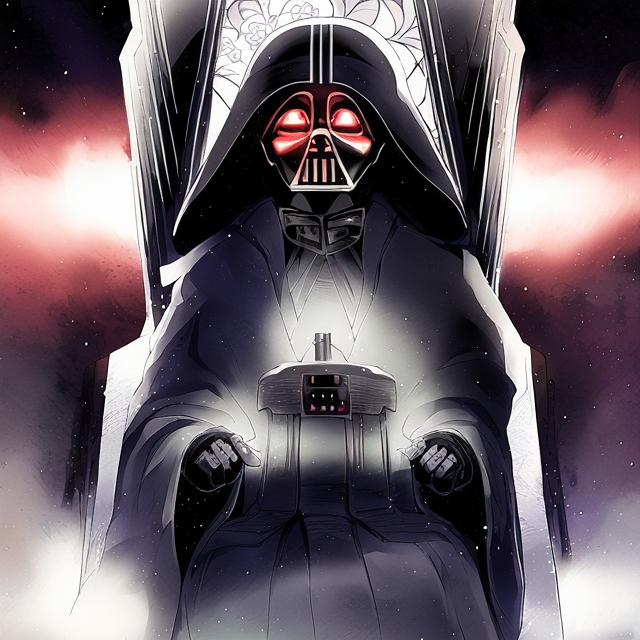

# Rise of Darth Vader

A long time ago, in a galaxy far, far away, the Galactic Empire was in a precarious position. The Rebel Alliance had gained momentum and was launching attacks on Imperial bases across the galaxy. The Emperor, fearing for the future of his empire, assigned his most trusted enforcer, Darth Vader, to crush the rebellion.

Darth Vader, a powerful Sith Lord and former Jedi Knight, had become a loyal servant of the Emperor after falling to the dark side of the Force. His reputation as a feared enforcer preceded him, and he was known to stop at nothing to achieve his goals.

Despite his fearsome reputation, the Rebel Alliance did not give up easily. They were a coalition of fighters who had come together with a shared goal of defeating the Empire and restoring freedom to the galaxy. Led by a group of rebels including Luke Skywalker, a young Jedi who had been trained by Obi-Wan Kenobi, they were determined to succeed.

The Rebels managed to steal the plans to the Empire's ultimate weapon, the Death Star, which they planned to use to destroy it. This was a major victory for the Rebel Alliance, as it gave them a chance to strike at the heart of the Empire and deal a crippling blow to their enemy.

Darth Vader knew he had to stop the Rebels at all costs. He led an attack on their base on the planet Hoth, but they managed to escape. Vader pursued them across the galaxy and engaged them in a fierce battle on the forest moon of Endor.

During the battle on the forest moon of Endor, Luke Skywalker fought bravely alongside the Rebel Alliance against the might of the Empire. However, despite his immense power and skill, he was eventually struck down by Darth Vader in a lightsaber duel that shook the very foundations of the forest.

With Luke dead, the Rebel Alliance was left without their greatest hero and leader. The Empire, emboldened by their victory, launched a final assault on the Rebel base and ultimately succeeded in destroying it. The Rebel Alliance was scattered, and the Empire reigned supreme.

For years, the galaxy lived under the iron fist of the Empire. Darth Vader, now the Emperor's most trusted enforcer, ruthlessly hunted down any remaining Rebel resistance and silenced any voices of dissent. The Jedi Order was no more, and the Force was forgotten by most.

Years turned into decades, and the galaxy became a bleak and desolate place. The Empire's reign of terror continued unabated, and any who dared to oppose it were met with swift and brutal punishment. The citizens of the galaxy lived in fear, and hope seemed like a distant memory.

As the years went on, rumors began to circulate about a new hope, a new leader who would rise up and challenge the Empire's rule. But these rumors were quickly silenced by the Empire's agents, and the galaxy remained under their control.

In the end, there was no rebellion, no hope, no hero to save the day. The Empire's grip on the galaxy was unbreakable, and it seemed as though it would last forever. The memory of Luke Skywalker and his sacrifice had faded into obscurity, overshadowed by the darkness that had consumed the galaxy.

And so the galaxy remained, a place of darkness and despair, ruled by an Empire that had forgotten what it meant to be human. The only hope for the galaxy was that one day, a hero would arise to challenge the Empire's rule and restore peace and justice to the galaxy. But for now, the galaxy remained under the shadow of the Empire, and the memory of Luke Skywalker and his sacrifice was all but forgotten.

