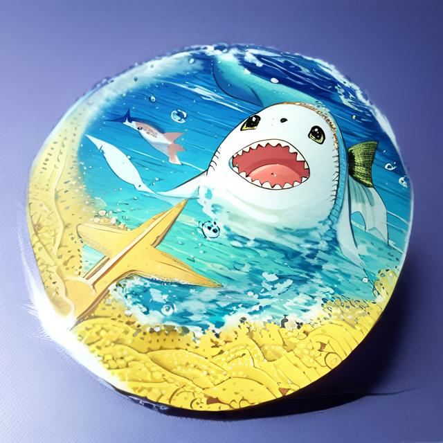
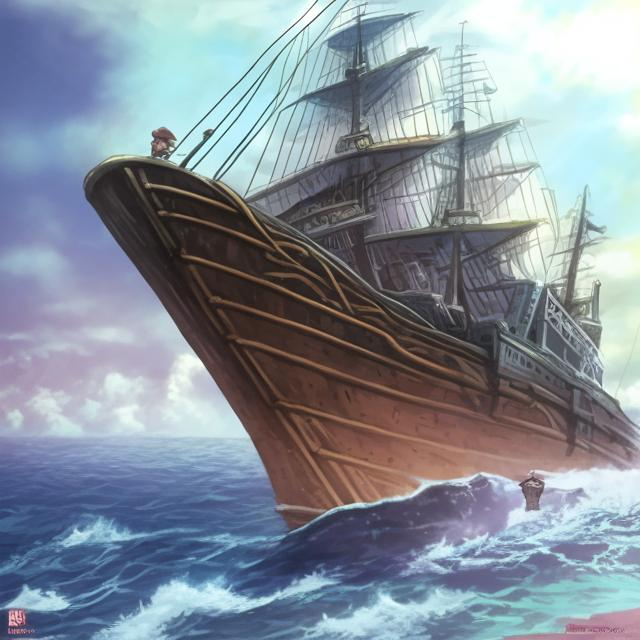
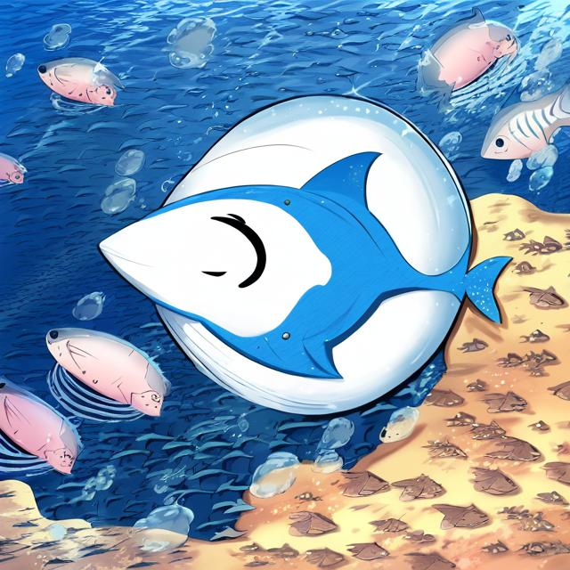

# The Adventure of Baby Shark

Once upon a time, in the vast ocean, there was a family of sharks. Among them was a little baby shark who was always curious about the outside world. He would always ask his mother about the world beyond the ocean, but she would always tell him that the ocean was his world and he should stay close to it.

One day, while playing with his siblings, the little baby shark saw a colorful fish jumping out of the water. The baby shark was amazed by what he saw and decided to follow the fish. He swam and swam until he reached the surface of the ocean.

As he looked up, he saw a big ship sailing on the surface of the water. The baby shark was so fascinated by the ship that he decided to follow it. He swam and swam, following the ship for hours, until he found himself in a completely different part of the ocean.

The baby shark was lost and scared, and he didn't know how to find his way back home. Suddenly, he saw a group of dolphins swimming towards him. The baby shark was frightened, but the dolphins were friendly and asked him what was wrong.

The little baby shark explained his situation to the dolphins. As the dolphins were helping the baby shark find his way back home, they suddenly heard the sound of a motorboat. It was a group of fishermen who were out hunting for sharks.

“Who are they?” The baby shark asked.

“They are Japanese.” The dolphins immediately recognized them as Japanese fishermen, who were notorious for their cruel treatment of sea creatures. The dolphins knew that they had to protect the baby shark from these cruel fishermen.

The dolphins tried to protect the baby shark, but they were outnumbered.

In the end, the baby shark was caught by one of the fishermen and taken away to be sold. The dolphins were devastated and didn't know what to do without their friend. They swam around for days, searching for him, but he was gone.

The baby shark was taken to a nearby fish market, where he was sold to a restaurant. He was cooked and served as a delicacy to the customers. The baby shark's family never knew what had happened to him, and they continued to search for him for years.

The dolphins never forgot their friend and were heartbroken by his tragic end. They swam around the ocean, feeling lost without him. The baby shark's curiosity had led him to a terrible fate, and his story became a cautionary tale among the sea creatures.

