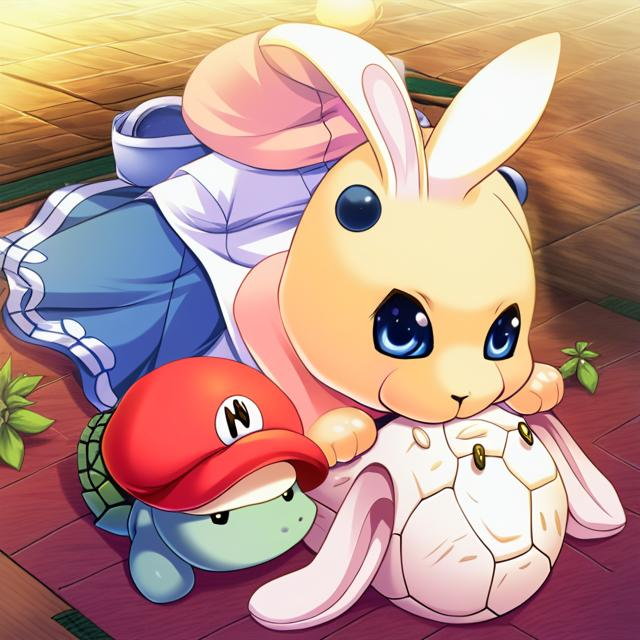
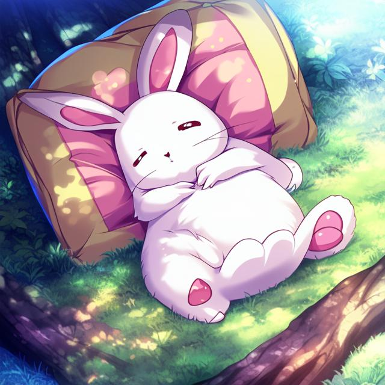
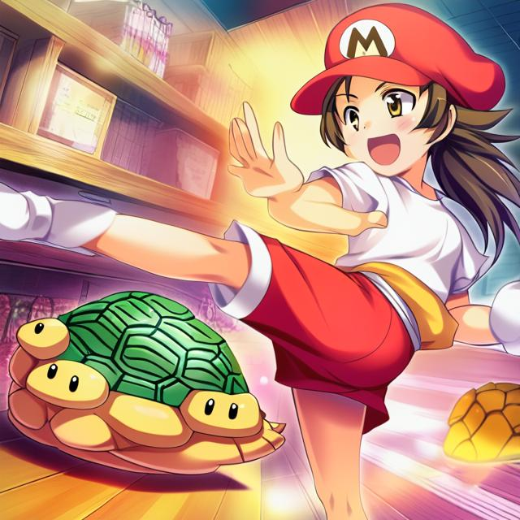

# Tortoise, Rabbit and Mario

Once upon a time, in a faraway land, there lived a tortoise and a rabbit. They were both very competitive and were always looking for ways to outdo each other. One day, they decided to have a race to determine who was the fastest.

The rabbit was confident that he would win the race. He was known for his speed and agility, and he had won many races before. The tortoise, on the other hand, was slow and steady. He knew he couldn't match the rabbit's speed, but he was determined to do his best.

The race began, and the rabbit quickly took the lead. He was so far ahead that he decided to take a nap under a tree. Meanwhile, the tortoise kept plodding along, steadily making his way towards the finish line.

As the tortoise approached the finish line, he was surprised to see someone else standing there. It was Mario, the famous game character. Mario was there to cheer on his friend, the rabbit, and he was not happy to see the tortoise nearing the finish line.

Without warning, Mario kicked the tortoise away, sending him flying into the air. The tortoise landed hard on the ground, but he was determined to finish the race. He got up and continued on his way.

The rabbit woke up from his nap and realized that he had overslept. He quickly got up and ran towards the finish line. As he approached, he saw the tortoise ahead of him. He was shocked that the slow and steady tortoise had managed to beat him.

But just as the tortoise was about to cross the finish line, Mario appeared again. This time, he kicked the tortoise even harder, sending him flying far away. The rabbit crossed the finish line first and was declared the winner.

The poor tortoise lay on the ground, bruised and battered. But he didn't feel too bad about losing the race. He knew that he had done his best, and that was all that mattered. As for Mario, he realized that his behavior was wrong and apologized to the tortoise.

In the end, the tortoise may not have won the race, but he had won something much more important - the respect of his friends and the admiration of all those who had witnessed his determination and perseverance.

